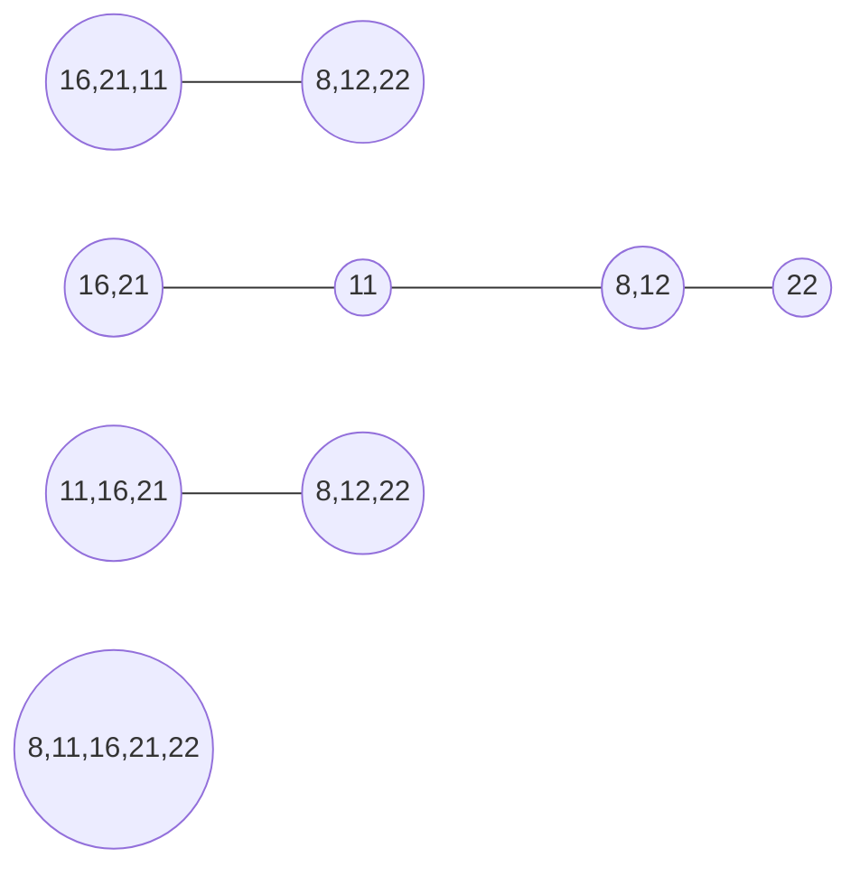

# Veri Yapıları ve Algoritmalar

## Merge Sort Projesi

### [16,21,11,8,12,22]

`Soru` Yukarıdaki dizinin sort türüne göre aşamalarını yazınız.

`Soru` Dizinin Big-O gösterimini yazınız.

    O(nlogn)
